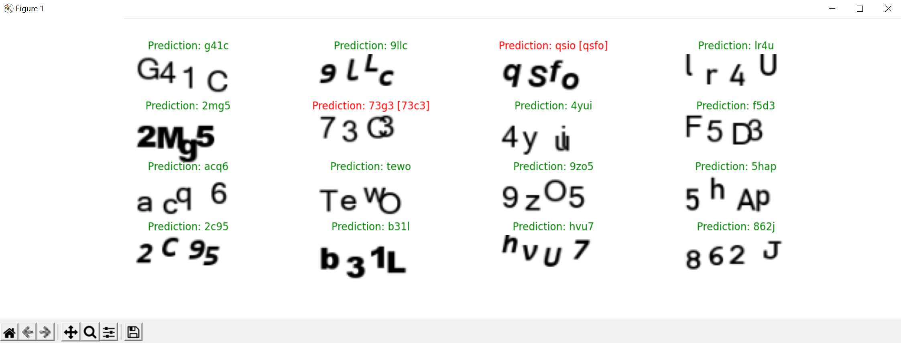
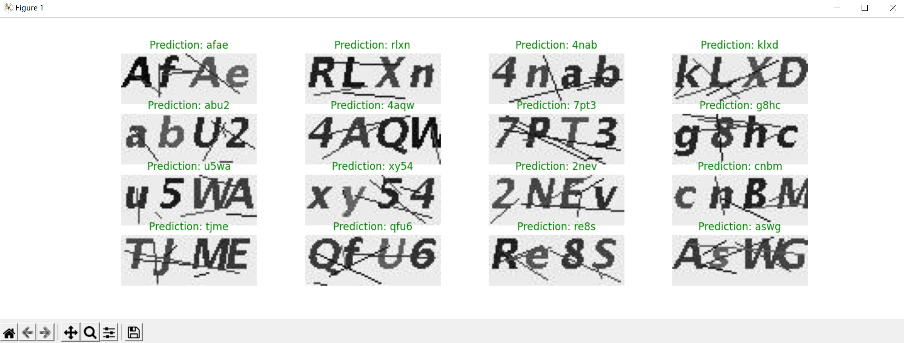

# 利用Tensorflow机器学习框架进行验证码识别
## 1. 项目简介
> 验证码（CAPTCHA）识别在网站中非常常见，是一种区分用户是计算机还是人的公共全自动程序，可以用于防止程序爬虫等功能。
> 验证码的存在对于我们利用程序访问某些网站造成了困难，由于验证码中人为添加的干扰元素，使得普通算法对于验证码的识别非常有难度。再加上不同字体的影响，验证码识别程序的通用性非常差，无法完成通用的验证码识别。
>
> 我们可以利用机器学习Tensorflow框架实现OCR识别模型创建针对性的模型对于网站的验证码进行预测。除了试图完成通用的验证码识别程序，我们还可以对于特定网站生成相似的验证码图像进行学习，针对性地预测。
> 整个过程基本是全自动化的，人力成本低，有较强的可行性。
## 2. 系统环境

### Python解释器、系统版本信息
> `Python 3.9.7 (tags/v3.9.7:1016ef3, Aug 30 2021, 20:19:38) [MSC v.1929 64 bit (AMD64)] on win32`
### 第三方库
> |库名称|版本|下载地址
> |-----|----|----|
> |Tensorflow|`2.6.0`|[下载Tensorflow==2.6.0（通过清华大学镜像下载）](https://pypi.tuna.tsinghua.edu.cn/packages/fb/93/d5e3751a9ca3d159cbe498ef112e4bca35a07cedaae83e61038606e72edf/tensorflow-2.6.0-cp39-cp39-win_amd64.whl)|
> |numpy|`1.19.5`|[下载numpy==1.19.5（通过清华大学镜像下载）](https://pypi.tuna.tsinghua.edu.cn/packages/bc/40/d6f7ba9ce5406b578e538325828ea43849a3dfd8db63d1147a257d19c8d1/numpy-1.19.5-cp39-cp39-win_amd64.whl)|
> |Pillow|`8.4.0`|[下载Pillow==8.4.0（通过清华大学镜像下载）](https://pypi.tuna.tsinghua.edu.cn/packages/20/ec/15a263f2c65d71cf62aa767f774c2381077e07beb1e9309a94461ec1cd29/Pillow-8.4.0-cp39-cp39-win_amd64.whl)|
> |matplotlib|`3.4.3`|[下载matplotlib==3.4.3（通过清华大学镜像下载）](https://pypi.tuna.tsinghua.edu.cn/packages/59/ea/1c00d9278c51d5f03276ac3f08773a13d93cbf2d722386ae8da083866697/matplotlib-3.4.3-cp39-cp39-win_amd64.whl)|
> |requests|`2.26.0`|[下载requests==2.26.0（通过清华大学镜像下载）](https://pypi.tuna.tsinghua.edu.cn/packages/e7/01/3569e0b535fb2e4a6c384bdbed00c55b9d78b5084e0fb7f4d0bf523d7670/requests-2.26.0.tar.gz)|
> 
> **注意安装时要保证 `keras` 版本为 `2.6.0` 否则可能导致程序无法运行，可安装 `Tensoflow` 后使用 `pip install keras==2.6.0` 命令。*

## 3. 项目文件总体框架
```
│  create_bit_captcha.py-------创建北京理工大学相似验证码图像
│  create_captcha.py-----------创建通用验证码图像
│  create_model.py-------------创建模型
│  dir.txt---------------------目录框架
│  get_captcha.py--------------爬虫下载验证码（北京理工大学统一身份认证）
│  predict.py------------------预测验证码
│  README.md-------------------说明文件
│  train_model.py--------------训练模型 
│  
├─bit_captcha------------------北京理工大学统一身份认证验证码（爬虫下载手动标记）
│      ......
│
├─captcha_fonts----------------验证码字体文件集合
│      arial.ttf
│      arialbi.ttf
│      ariblk.ttf
│      ARLRDBD.TTF
│      bahnschrift.ttf
│      cambriab.ttf
│      consolaz.ttf
│      courbd.ttf
│      micross.ttf
│      msyh.ttc
│      
├─model saved-----------------保存的模型
│  ├─model_80x30_bit_captcha--北京理工大学统一身份认证验证码识别模型
│  │  ├─model-----------------模型数据（不可用于预测，可载入模型继续训练）
│  │  │      checkpoint
│  │  │      model_weights.data-00000-of-00001
│  │  │      model_weights.index
│  │  │      
│  │  └─model_to_predict------完整已训练的模型（可用于预测）
│  │      │  keras_metadata.pb
│  │      │  saved_model.pb
│  │      │  
│  │      ├─assets
│  │      └─variables
│  │              variables.data-00000-of-00001
│  │              variables.index
│  │              
│  └─model_90x35_general-------通用验证码识别模型
│      ├─model-----------------模型数据（不可用于预测，可载入模型继续训练）
│      │      checkpoint
│      │      model_weights.data-00000-of-00001
│      │      model_weights.index
│      │      
│      └─model_to_predict------完整已训练的模型（可用于预测）
│          │  keras_metadata.pb
│          │  saved_model.pb
│          │  
│          ├─assets
│          └─variables
│                  variables.data-00000-of-00001
│                  variables.index
│                  
└─results_image----------------成果展示
        1.PNG
        2.PNG
        3.PNG
        4.PNG
        5.PNG
        6.PNG
        7.PNG
        bit_captcha_created.PNG
        captcha.PNG
        real_bit_captcha.PNG
        利用TensorFlow进行验证码识别.pptx
```
## 4. 项目流程、技术细节介绍
### i. 创建训练所需验证码图像
> 验证码的生成有以下几个方面的考虑：验证码字体样式、图片字体大小，水平和竖直排列、字体颜色、背景颜色、噪点（个数、颜色）、干扰线（条数、颜色）、图片扭曲、字母边界增强等。
>
> 利用Python图像库 `PIL` 以及随机库 `random` ，可以基本满足对于验证码图片的生成。图片大小设置为 `100*40` 像素，包含4个待识别待识别的大小写字母、数字；其中字体样式选择与目标识别验证码相似的多款字体；水平竖直排列在一定范围内随机；字体颜色、背景颜色采用随机的RGB数值；噪点数和干扰线数设置为10个、2条，颜色随机；对于最后生成的图片进行随机的扭曲以及滤镜处理。
>
> 这个项目里我们将使用两种样本，一种试图生成包含多种处理手段的验证码图像完成通用的验证码识别，另一种针对特定网站（北京理工大学统一身份认证）生成特定的验证码。
### ii. 将样本、标签进行预处理和归一化处理
>对于深度学习网络而言，输入的数据需要转化成实数组成的向量。对于图片，统一大小后进行灰度处理，然后将每个像素点的RGB值映射到`[0,1]`区间的实数内；对于标签，将`0~9,𝑎~𝑧`作为字符集将验证码字母映射为数字。
>
>说明：这里对于图片暂时不进行包括分割、去除噪音等繁琐的预处理过程，直接输入。考虑到一般网站的验证码不考虑大小写且较大的字符集对于模型的拟合有更大挑战，这里仅考虑小写字符和数字作为输出（输入包含大写字母）。

### iii. 构建深度学习神经网络模型
>这里利用 `TensorFlow` 框架以及相应api构建了一个简单的OCR识别模型，包括了CNN(输入层、Conv2D、数据最大池化技术)、RNN循环、优化器、CTC损失函数、输出层。这里对于模型的具体构建不进行讨论，仅对网络的基本参数例如 `batch_size` （批尺寸）、 `epoch` （训练次数）、 `early_stopping_patience` (提前停止拟合的最大容忍次数)进行调整。
>
>保存模型由于技术原因只能保存数据以及丢失了训练所需要的函数的模型（不能再次训练但是可以利用其进行预测）。

### iv. 利用样本和标签对于模型进行拟合
>使用 `model.fit` 函数对于预处理好的图像和标签进行拟合。

### v. 利用简单的爬虫下载相应网站的少量验证码，手动标签用于测试
>使用 `requests` 库下载北京理工大学统一身份认证验证码图片（仅适用于针对性训练版本）。

## 5. 关键代码说明（具体实现参考源代码）
### 创建训练用的验证码图片
```python
img = ValidCodeImg(width=random.randint(100, 100), height=random.randint(40, 40),# 设置验证码宽和高为100像素
                   code_count=4, font_size=24, # 验证码字符个数和字体大小
                   point_count=10, line_count=2, # 验证码干扰点和线数目
                   is_transform=random.choice([True]),# 是否添加扭曲效果
                   is_filter=random.choice([True]),# 是否添加滤镜效果
                   background_random=random.choice([True]),# 背景颜色是否随机
                   color_random=random.choice([True]),# 字体颜色是否随机
                   font_dir=random.choice(["ARLRDBD.TTF", "cambriab.ttf", "courbd.ttf", # 验证码使用的字体
                                           "bahnschrift.ttf","arial.ttf", "ariblk.ttf",
                                           "micross.ttf", "arialbi.ttf","consolaz.ttf"]),
                   img_format='png', is_show=False) # 选择验证码图片格式以及是否展示生成的图片
data, valid_str = img.getValidCodeImg() # 创建验证码图片以及对应字符串
```
### 输入数据预处理
```python
def encode_single_sample(img_path, label): # 处理单张验证码图片
    img = tf.io.read_file(img_path) # 读取图像
    img = tf.io.decode_png(img, channels=1) # 解码并转换为灰度图片    
    img = tf.image.convert_image_dtype(img, tf.float32) # 将图片数据转化为[0,1]区间内的float32变量
    img = tf.image.resize(img, [img_height, img_width]) # 调整图片至预设大小
    img = tf.transpose(img, perm=[1, 0, 2]) # 转置图像使图像的宽对应于时间维度
    label = char_to_num(tf.strings.unicode_split(label, input_encoding="UTF-8")) #将验证码对于字符映射为数字
    return {"image": img, "label": label}# 返回处理后的图片数据、标签数据元组
```
### 建立模型
```python
def build_model():
    input_img = layers.Input( # 创建输入层
        shape=(img_width, img_height, 1), name="image", dtype="float32"
    )
    labels = layers.Input(name="label", shape=(None,), dtype="float32")

    x = layers.Conv2D(  # 二维卷积层1
        32,
        (3, 3),
        activation="relu",
        kernel_initializer="he_normal",
        padding="same",
        name="Conv1",
    )(input_img)
    x = layers.MaxPooling2D((2, 2), name="pool1")(x)

    x = layers.Conv2D( # 二维卷积层2
        64,
        (3, 3),
        activation="relu",
        kernel_initializer="he_normal",
        padding="same",
        name="Conv2",
    )(x)
    x = layers.MaxPooling2D((2, 2), name="pool2")(x)

    # 池化技术
    new_shape = ((img_width // 4), (img_height // 4) * 64)
    x = layers.Reshape(target_shape=new_shape, name="reshape")(x)
    x = layers.Dense(64, activation="relu", name="dense1")(x)
    x = layers.Dropout(0.2)(x)
    
    # 循环神经网络
    x = layers.Bidirectional(layers.LSTM(128, return_sequences=True, dropout=0.25))(x)
    x = layers.Bidirectional(layers.LSTM(64, return_sequences=True, dropout=0.25))(x)

    x = layers.Dense( # 输出层
        len(char_to_num.get_vocabulary()) + 1, activation="softmax", name="dense2"
    )(x)

    output = CTCLayer(name="ctc_loss")(labels, x) # 添加损失函数

    model = keras.models.Model( # 建立模型
        inputs=[input_img, labels], outputs=output, name="ocr_model_v1"
    )
    opt = keras.optimizers.Adam() # 创建优化器
    model.compile(optimizer=opt) # 编译模型并返回
    return model
```
### 利用模型进行预测
```python
def decode_batch_predictions(pred):
    input_len = np.ones(pred.shape[0]) * pred.shape[1]
    results = keras.backend.ctc_decode(pred, input_length=input_len, greedy=True)[0][0][ #利用贪心搜索获取最佳路径
        :, :max_length
    ]
    output_text = []
    for res in results: # 遍历输出结果获取预测文本
        res = tf.strings.reduce_join(num_to_char(res)).numpy().decode("utf-8")
        output_text.append(res)
    return output_text # 返回预测文本
```
### 利用”北理统一身份认证“验证码测试模型在未训练的数据集上的准确度
```python
import requests

url = "http://login.bit.edu.cn/authserver/getCaptcha.htl?" # 验证码生成目标url
headers = { 
    'User-Agent': 'Mozilla/5.0 (Windows NT 10.0; Win64; x64) AppleWebKit/537.36 (KHTML, like Gecko) Chrome/94.0.4606.81 Safari/537.36'
}
for i in range(16):
    img = requests.get(url) # 获取验证码
    with open(str(i) + ".png", "wb") as f:
        f.write(img.content) # 将验证码写入文件保存
```
## 6. 运行效果展示
> 通用性验证码识别样本
> 

>北京理工大学统一身份认证验证码（利用爬虫下载、手动标记）
> 

>模拟北京理工大学统一身份认证验证码自动生成的样本
> 

>识别包含多种字体但是完全均匀排布的样本
> 

>识别字体纵向位置和间距随机的样本
> 

>识别增加干扰线和干扰噪点的样本
> 

>识别增加滤镜和扭曲效果的样本
> 

>识别背景颜色和字体颜色随机的样本
> 

>尝试识别未（针对）训练过的样本
> 

>针对该样本（北京理工大学统一身份认证）进行学习后识别(测试图片未放入样本)
> 

## 7. 项目总结及完成度自我评价
> 可见，针对通用性识别程序，对于“特效拉满”的验证码的识别率较低，主要是源于颜色的干扰；对于未训练过的验证码类别识别率较低，即使其相对于训练集的识别难度简单很多，程序通用性较差。 
>
> 仔细观察可以发现，训练集中有些验证码甚至人类也很难识别，原因包括但不限于字体和背景颜色太过相近、不同字体造成不同字符可能过于相似`I,i,L,l,o,0,O`、个别验证码由于扭曲程度问题字母超出了图片范围。个人认为识别这种验证码的意义不大，甚至添加如此干扰元素于训练集对于模型是不利的。因此应该在生成验证码图片的过程中去除这些干扰，提高训练样本的质量。对于第二个问题，可以增大训练样本数量，囊括更多的验证码样式，让识别程序的通用性更强。
> 
> 虽然通用性识别有很多可以改进的地方，但是可以预见完成验证码的通用性识别是非常困难的。因此有针对性的识别更加有意义，根据特定验证码可以修改验证码的生成程序，以生成非常相似的训练样本。当然，仅仅有这些模拟样本是不足的，形式太过于统一对于实际图像的识别是不利的。这里我加入了300张真正的验证码图片（手动标记）进入样本中，配合5000张自动生成的样本，实际效果非常好（测试图像全部成功正确识别）。
>
> 至此，项目目标基本完成。